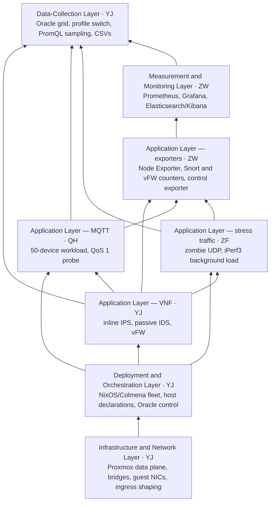
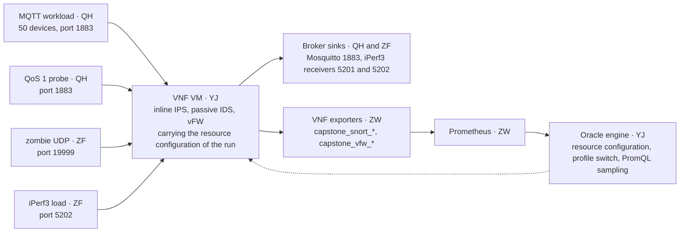

# Bristol Capstone G3012 — Network Group

This repository carries the network group's code for the Bristol MSc capstone project *Offline VNF Profiling for IoT/MQTT with a Proxmox/KVM + NixOS testbed*: the Colmena deployment of the testbed, the three switchable security VNF profiles, the workload and measurement applications, the exporters and the monitoring stack, and the Oracle data-collection engine that produced the experimental dataset. The report's AI layers are not part of it.

## Live testbed

- <https://topology.ejun.org/> is the running testbed and the entry point to it: the interactive topology of this project, the experiment switches and the Oracle collection control.
- <https://grafana.ejun.org/d/wangzheng/> is the live monitoring dashboard of a campaign, open to anyone without an account: per-host service status, generator and probe rates, the VNF resource panels and the profile packet-processing panels.
- <https://prometheus.ejun.org/> is the time-series store behind every reported KPI, scraping each exporter every 15 seconds and keeping seven days of series.
- <https://iot.ejun.org/metrics> is the IoT host exporter endpoint: the MQTT workload, QoS probe and zombie generator counters beside the host figures.
- <https://vnf.ejun.org/metrics> is the VNF exporter endpoint: the packet-processing counters of the active profile.
- <https://broker.ejun.org/metrics> is the Broker exporter endpoint: what arrives at the MQTT broker and at the iPerf3 load sink.
- <https://kibana.ejun.org/app/dashboards#/view/capstone-cross-profile> is the completed dataset compared across the three profiles.
- <https://kibana.ejun.org/app/dashboards#/view/capstone-inline> is the inline IPS profile across the whole resource grid.
- <https://kibana.ejun.org/app/dashboards#/view/capstone-passive> is the passive IDS profile across the same grid.
- <https://kibana.ejun.org/app/dashboards#/view/capstone-vfw> is the nftables vFW profile across the same grid.
- <https://kibana.ejun.org> is the Kibana entry point for exploring the imported profile datasets.

## Layer dependencies

The layers form a stack rather than a set of parallel workstreams: each layer is built on the layer below it, and the Data-Collection Layer at the top is assembled last, once the layers beneath it work. The VNF is the subject at the centre of the stack: the workload layers offer their traffic across it, the exporters read its counters, and the resource configuration and profile switch act on it.



Where the VNF sits in the measured path — every workload crosses it and every reported packet-processing result is read from it:



The dashed edge is the control direction: the engine shapes the link, applies the vCPU and memory configuration, and switches the active profile before it measures.

- **Infrastructure and Network** is the foundation: the two data-plane bridges, the guest NICs pinned to them and the ingress shaper exist before any guest is deployed, and every later layer is reached across that path.
- **Deployment and Orchestration** builds and activates the guests onto that path.
- **Application Layer — VNF** is the subject the campaign measures: one VM, three switchable profiles, one resource grid covering vCPU set, memory target and ingress-link capacity. The workload layers are offered across it and the packet-processing counters are read from it.
- **MQTT** and **stress traffic** place the legitimate workload and the controlled pressure on either side of that path. The QoS 1 probe and the iPerf3 load are measured through the VNF, so they run together with the active profile.
- The **exporter Application Layer** attaches counters to the running profile and to the generators, which is what makes the packet-processing results observable.
- **Measurement and Monitoring** scrapes what the exporters publish and holds the series the campaign reads.
- **Data-Collection** comes last: the Oracle engine applies the resource configuration, switches the profile, starts the workload, and only then reads the KPIs back through PromQL — it waits for every layer below rather than being built alongside them.

## Contribution map

Every file this repository tracks, listed under the member and the layer that contributed it. No entry names a directory: each one is a single file. A file that carries two roles appears once per role.

| Member | Layer | Files |
|---|---|---|
| Yijun Jiang (YJ) | Infrastructure and Network | [capstone-inline-network.md](local/colmena/provisioning/capstone-inline-network.md), [capstone-oracle-grid-common.sh](local/colmena/scripts/capstone-oracle-grid-common.sh), [vnf.nix](local/colmena/hosts/vm/vnf.nix), [iot.nix](local/colmena/hosts/ct/iot.nix), [broker.nix](local/colmena/hosts/ct/broker.nix) |
| Yijun Jiang (YJ) | Deployment and Orchestration | [hive.nix](hive.nix), [nixpkgs.nix](nixpkgs.nix), [.colmena-helper.sh](.colmena-helper.sh), [vnf.nix](local/colmena/hosts/vm/vnf.nix), [iot.nix](local/colmena/hosts/ct/iot.nix), [broker.nix](local/colmena/hosts/ct/broker.nix), [brain.nix](local/colmena/hosts/ct/brain.nix), [devshell.nix](local/colmena/hosts/ct/devshell.nix) |
| Yijun Jiang (YJ) | Application — VNF | [snort-inline.nix](local/colmena/modules/services/snort-inline.nix), [snort-passive.nix](local/colmena/modules/services/snort-passive.nix), [vfw.nix](local/colmena/modules/services/vfw.nix) |
| Yijun Jiang (YJ) | Data Collection | [capstone-oracle-grid-common.sh](local/colmena/scripts/capstone-oracle-grid-common.sh), [capstone-oracle-grid-inline.sh](local/colmena/scripts/capstone-oracle-grid-inline.sh), [capstone-oracle-grid-passive.sh](local/colmena/scripts/capstone-oracle-grid-passive.sh), [capstone-oracle-grid-vfw.sh](local/colmena/scripts/capstone-oracle-grid-vfw.sh), [add_data_split.py](datasets/add_data_split.py), [inline.csv](datasets/inline.csv), [passive.csv](datasets/passive.csv), [vfw.csv](datasets/vfw.csv) |
| Qiang Hao (QH) | Application — MQTT | [capstone-mqtt-traffic.nix](local/colmena/modules/services/capstone-mqtt-traffic.nix), [capstone-mqtt-traffic.py](local/colmena/packages/capstone-mqtt-traffic.py), [capstone-mqtt-probe.nix](local/colmena/modules/services/capstone-mqtt-probe.nix), [capstone-mqtt-probe.py](local/colmena/packages/capstone-mqtt-probe.py), [mosquitto.nix](local/colmena/modules/services/mosquitto.nix) |
| Zihao Fan (ZF) | Application — stress traffic | [capstone-zombie-traffic.nix](local/colmena/modules/services/capstone-zombie-traffic.nix), [capstone-zombie-traffic.py](local/colmena/packages/capstone-zombie-traffic.py), [iperf3-client.nix](local/colmena/modules/services/iperf3-client.nix), [capstone-iperf3-client.py](local/colmena/packages/capstone-iperf3-client.py), [iperf3-load-sink.nix](local/colmena/modules/services/iperf3-load-sink.nix), [iperf3-sink.nix](local/colmena/modules/services/iperf3-sink.nix) |
| Zheng Wang (ZW) | Application — exporters | [node-exporter.nix](local/colmena/modules/services/node-exporter.nix), [capstone-snort-metrics.py](local/colmena/packages/capstone-snort-metrics.py), [snort-inline.nix](local/colmena/modules/services/snort-inline.nix), [snort-passive.nix](local/colmena/modules/services/snort-passive.nix) |
| Zheng Wang (ZW) | Measurement and Monitoring | [prometheus.nix](local/colmena/modules/services/prometheus.nix), [grafana.nix](local/colmena/modules/services/grafana.nix), [elasticsearch-kibana.nix](local/colmena/modules/services/elasticsearch-kibana.nix), [kibana-provision-capstone.py](local/colmena/modules/services/kibana-provision-capstone.py), [wangzheng.json](local/colmena/hosts/ct/wangzheng.json), [gen_wangzheng.py](local/colmena/hosts/ct/gen_wangzheng.py) |
| Yijun Jiang (YJ) | Misc | [ct.nix](local/colmena/modules/ct.nix), [vm.nix](local/colmena/modules/vm.nix), [common.nix](local/colmena/modules/base/nix/common.nix), [nix-cache.nix](local/colmena/modules/base/nix/nix-cache.nix), [proxmox-lxc.nix](local/colmena/modules/base/nix/proxmox-lxc.nix), [system.nix](local/colmena/modules/base/nix/system.nix), [tools.nix](local/colmena/modules/base/tools.nix), [ssh-user-key.nix](local/colmena/modules/base/ssh-user-key.nix), [node.nix](local/colmena/modules/env/runtime/node.nix), [README.md](README.md), [.gitignore](.gitignore) |

## Infrastructure and Network Layer (YJ)

The Proxmox VE side that carries the measured path: two addressless data-plane bridges (`vmbr110`, `vmbr120`) kept separate from the `vmbr0` management plane, the guest NICs pinned to them, and the temporary ingress shaper that emulates a finite IoT-to-VNF link.

- [provisioning/capstone-inline-network.md](local/colmena/provisioning/capstone-inline-network.md) — PVE bridge and guest-NIC runbook: bridge declarations, MAC-to-guest assignment, addresses.
- [scripts/capstone-oracle-grid-common.sh:75](local/colmena/scripts/capstone-oracle-grid-common.sh#L75) — `set_tc()` applies or removes the TBF qdisc on the host-side tap that sets the ingress-link capacity of each configuration.
- [hosts/vm/vnf.nix:17](local/colmena/hosts/vm/vnf.nix#L17) — the two `/30` data-plane addresses on `ens19`/`ens20`, and [line 32](local/colmena/hosts/vm/vnf.nix#L32) enables `net.ipv4.ip_forward`.
- [hosts/ct/iot.nix:42](local/colmena/hosts/ct/iot.nix#L42) and [hosts/ct/broker.nix:19](local/colmena/hosts/ct/broker.nix#L19) — data-plane interface matched by MAC, with reciprocal static routes that force both directions through the VNF.

## Deployment and Orchestration Layer (YJ)

One Colmena hive declares every guest, so each machine is reproduced from the module set instead of accumulated manual state. The fleet definition in [hive.nix](hive.nix) maps each node to its SSH target and host module; [nixpkgs.nix](nixpkgs.nix) pins the nixpkgs revision; [.colmena-helper.sh](.colmena-helper.sh) wraps Colmena with the required `-f hive.nix`.

- Host declarations: [hosts/vm/vnf.nix](local/colmena/hosts/vm/vnf.nix), [hosts/ct/iot.nix](local/colmena/hosts/ct/iot.nix), [hosts/ct/broker.nix](local/colmena/hosts/ct/broker.nix), [hosts/ct/brain.nix](local/colmena/hosts/ct/brain.nix), [hosts/ct/devshell.nix](local/colmena/hosts/ct/devshell.nix). Each imports the modules for the services that machine runs, on top of the module bases and base modules shared by every host; those belong to no layer of their own and are described under [Misc](#misc-yj).
- [hosts/ct/devshell.nix:26](local/colmena/hosts/ct/devshell.nix#L26) — the control exporter on the Oracle host: it reads the real service state of every machine and exports `capstone_service_up` (plus the control-switch series) that the dashboard heatmaps use.

```sh
./.colmena-helper.sh build                       # evaluate and build every node
./.colmena-helper.sh apply --on vnf              # build and activate one machine
```

## Application Layer — VNF (YJ)

One VM hosts three mutually exclusive security profiles. A campaign stops the other profile services before measuring the target profile, so switching profiles swaps both the active service and the forwarding table.

- [snort-inline.nix](local/colmena/modules/services/snort-inline.nix) — in-path Snort 3 inline IPS: the [nftables forward chain](local/colmena/modules/services/snort-inline.nix#L174) hands packets to NFQUEUE 0, the [service](local/colmena/modules/services/snort-inline.nix#L192) runs the IDS, and the policy permits MQTT `tcp/1883` and iPerf `udp/5202` while blocking zombie UDP `19999`.
- [snort-passive.nix](local/colmena/modules/services/snort-passive.nix) — passive Snort 3 IDS in tap mode with the pcap DAQ: it [alerts on the same flow classes](local/colmena/modules/services/snort-passive.nix#L88) without taking a forwarding decision.
- [vfw.nix](local/colmena/modules/services/vfw.nix) — nftables virtual firewall with drop-by-default policy and named counters ([`fwd_count`/`drop_count`](local/colmena/modules/services/vfw.nix#L167), [allow and drop rules](local/colmena/modules/services/vfw.nix#L174)), carrying [its own counter exporter](local/colmena/modules/services/vfw.nix#L223) that publishes `capstone_vfw.prom`.

## Data-Collection Layer (YJ)

The Oracle engine turns one configuration into one CSV row: three thin profile wrappers fix `PROFILE` and the default CSV path ([example](local/colmena/scripts/capstone-oracle-grid-inline.sh#L5)) and then `exec` the shared engine, so the three profiles differ only in policy and not in measurement procedure.

- [scripts/capstone-oracle-grid-common.sh](local/colmena/scripts/capstone-oracle-grid-common.sh) — the shared engine: [the deterministic 476-configuration grid and runtime resource application](local/colmena/scripts/capstone-oracle-grid-common.sh#L87), [workload start](local/colmena/scripts/capstone-oracle-grid-common.sh#L97), and the instant PromQL queries that append twelve 60-second observation rows per configuration.
- [scripts/capstone-oracle-grid-inline.sh](local/colmena/scripts/capstone-oracle-grid-inline.sh), [scripts/capstone-oracle-grid-passive.sh](local/colmena/scripts/capstone-oracle-grid-passive.sh), [scripts/capstone-oracle-grid-vfw.sh](local/colmena/scripts/capstone-oracle-grid-vfw.sh) — the per-profile wrappers.
- [datasets/inline.csv](datasets/inline.csv), [datasets/passive.csv](datasets/passive.csv), [datasets/vfw.csv](datasets/vfw.csv) — the collected dataset, 5,784 records per profile; [datasets/add_data_split.py:17](datasets/add_data_split.py#L7) reproduces the canonical train/validation/test split.

## Application Layer — MQTT (QH)

The legitimate workload and the QoS observation it produces: a 50-device generator that maximises realistic heterogeneity, a separate probe that minimises workload variability, and the broker both talk to.

- [modules/services/capstone-mqtt-traffic.nix:14](local/colmena/modules/services/capstone-mqtt-traffic.nix#L14) — the generator service on the IoT host, with [packages/capstone-mqtt-traffic.py:64](local/colmena/packages/capstone-mqtt-traffic.py#L62) holding the 50 embedded device profiles and their schedules.
- [modules/services/capstone-mqtt-probe.nix:14](local/colmena/modules/services/capstone-mqtt-probe.nix#L14) — the QoS 1 probe service, with [packages/capstone-mqtt-probe.py:29](local/colmena/packages/capstone-mqtt-probe.py#L24) sampling publish-to-ack latency and [line 203](local/colmena/packages/capstone-mqtt-probe.py#L197) classifying acknowledged and lost publications per window.
- Both services drop their textfile on stop, so a stopped component renders as a zero line rather than its last value: [capstone-mqtt-traffic.nix:34](local/colmena/modules/services/capstone-mqtt-traffic.nix#L34) and [capstone-mqtt-probe.nix:40](local/colmena/modules/services/capstone-mqtt-probe.nix#L40).
- [modules/services/mosquitto.nix:6](local/colmena/modules/services/mosquitto.nix#L6) — Mosquitto bound to the Broker data-plane address `10.77.20.2:1883`.

## Application Layer — stress traffic (ZF)

The two controlled pressure inputs of the profiling sequence: mode-controlled UDP stress towards the Broker on port `19999`, and an on-demand iPerf3 background flow towards port `5202`. The layer generates and controls that traffic; how the active VNF profile observes or blocks it is measured outside this layer.

- [modules/services/capstone-zombie-traffic.nix:13](local/colmena/modules/services/capstone-zombie-traffic.nix#L13) — the supervised zombie UDP generator service, with [packages/capstone-zombie-traffic.py:25](local/colmena/packages/capstone-zombie-traffic.py#L18) defining the `off`/`low`/`high`/`panic`/`critical` rate modes.
- [modules/services/iperf3-client.nix:22](local/colmena/modules/services/iperf3-client.nix#L22) — the iPerf3 background-load client on the IoT host, with [packages/capstone-iperf3-client.py](local/colmena/packages/capstone-iperf3-client.py) writing its live throughput, jitter and loss to the textfile collector.
- [modules/services/iperf3-load-sink.nix:6](local/colmena/modules/services/iperf3-load-sink.nix#L6) — the Broker-side receiver for that background load on port `5202`; [modules/services/iperf3-sink.nix:6](local/colmena/modules/services/iperf3-sink.nix#L6) is the separate `5201` iPerf KPI sink.

## Application Layer — exporters (ZW)

Application-level exporters that turn service and packet-processing state into Prometheus textfile metrics, so the monitoring layer sees the real state of each component.

- [node-exporter.nix:39](local/colmena/modules/services/node-exporter.nix#L39) — the Node Exporter module, enabled per machine with a machine-specific collector set (textfile on the IoT and VNF hosts, systemd on the Broker and Brain).
- [packages/capstone-snort-metrics.py](local/colmena/packages/capstone-snort-metrics.py) — the Snort counter exporter: it parses the Snort perf-monitor JSON and alert files and writes them to the textfile collector. [snort-inline.nix:126](local/colmena/modules/services/snort-inline.nix#L126) and its [timer](local/colmena/modules/services/snort-inline.nix#L246) run it for the inline profile, and [snort-passive.nix:108](local/colmena/modules/services/snort-passive.nix#L108) for the passive profile; the vFW profile carries its own exporter inside [vfw.nix](local/colmena/modules/services/vfw.nix#L223).

## Measurement and Monitoring Layer (ZW)

Prometheus collects on Brain, Grafana renders during execution, and Elasticsearch/Kibana provide the offline view of completed datasets. Brain observes exported metrics over the management network and never sits in the measured forwarding path.

- [modules/services/prometheus.nix:19](local/colmena/modules/services/prometheus.nix#L19) — the scrape jobs (`vnf-snort`, `iot-devices`, `broker-sink`, `devshell-control`, `pve01`, `brain-self`) at a 15-second interval, with [seven-day retention and the remote-write receiver](local/colmena/modules/services/prometheus.nix#L15).
- [modules/services/grafana.nix:8](local/colmena/modules/services/grafana.nix#L8) — the provisioned live dashboards, with [data-source and dashboard provisioning](local/colmena/modules/services/grafana.nix#L32).
- [hosts/ct/wangzheng.json](local/colmena/hosts/ct/wangzheng.json) — the generated dashboard, produced by [gen_wangzheng.py](local/colmena/hosts/ct/gen_wangzheng.py). The generator, not the JSON, is the definition of what a dashboard contains.
- [modules/services/elasticsearch-kibana.nix](local/colmena/modules/services/elasticsearch-kibana.nix) — Elasticsearch and Kibana as Docker containers on Brain for the completed dataset.
- [modules/services/kibana-provision-capstone.py:83](local/colmena/modules/services/kibana-provision-capstone.py#L80) — idempotent provisioning of the four saved-object dashboards (cross-profile compare plus one per profile).

## Misc (YJ)

Support that belongs to no layer of its own: the module bases and base modules that every host declaration imports on top of its service modules, the Node.js runtime module the Brain host imports, and the two repository-level files.

- [ct.nix](local/colmena/modules/ct.nix) — the container base: [it imports the VM base beside the LXC system and Proxmox profile modules](local/colmena/modules/ct.nix#L4).
- [vm.nix](local/colmena/modules/vm.nix) — the VM base: [it imports the shared Nix settings, the cache mirror and the CLI set](local/colmena/modules/vm.nix#L4).
- [common.nix](local/colmena/modules/base/nix/common.nix) — the Nix settings every machine shares: [nix-command and flakes](local/colmena/modules/base/nix/common.nix#L4), `allowUnfree`, the sandbox off, and `root` and `jacka1` as trusted users.
- [nix-cache.nix](local/colmena/modules/base/nix/nix-cache.nix) — the TUNA substituter with the `cache.nixos.org` public key, so a rebuild inside the lab resolves from a fast mirror.
- [proxmox-lxc.nix](local/colmena/modules/base/nix/proxmox-lxc.nix) — the Proxmox LXC profile: [the container network stays unmanaged and the container privileged](local/colmena/modules/base/nix/proxmox-lxc.nix#L7), which keeps the data-plane interfaces under the host's control, plus the null-password sshd console.
- [system.nix](local/colmena/modules/base/nix/system.nix) — what a container boot needs: GRUB off, `boot.isContainer`, [the LXC root device](local/colmena/modules/base/nix/system.nix#L7) and the three suppressed systemd units.
- [tools.nix](local/colmena/modules/base/tools.nix) — [the small CLI set](local/colmena/modules/base/tools.nix#L3) every machine carries: `htop`, `wget`, `curl`, `nano`.
- [ssh-user-key.nix](local/colmena/modules/base/ssh-user-key.nix) — the `services.user-ssh-key` option with [the activation script](local/colmena/modules/base/ssh-user-key.nix#L18) that generates an ed25519 key for `jacka1` when one is missing.
- [node.nix](local/colmena/modules/env/runtime/node.nix) — the Node.js runtime module: [nodejs with npm, yarn, typescript, ts-node, nodemon and pm2](local/colmena/modules/env/runtime/node.nix#L5), with `NODE_ENV`, the `/etc/node` prefix and its tmpfiles.
- [README.md](README.md) — this document: the live testbed entry points, the layer stack and the contribution map.
- [.gitignore](.gitignore) — the ignored paths: `.omc/`, the exporter config, `core`, `__pycache__/`, the Playwright CLI state and `local/me/`.
